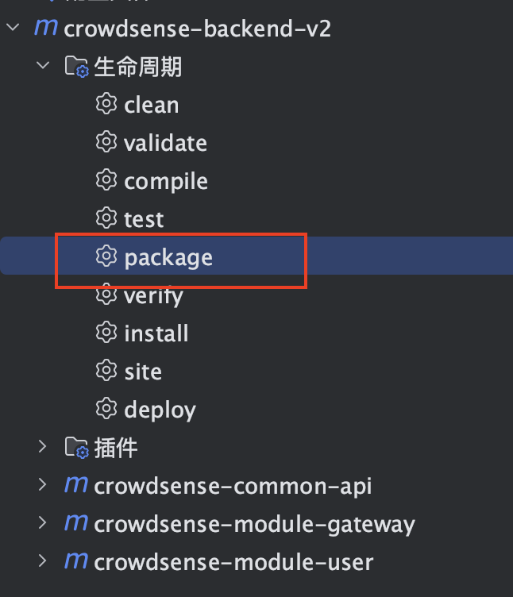
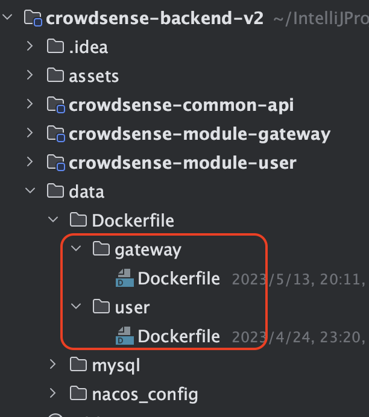

# 智群感知-V2

# 后端部署教程

> 下面所有环境的配置安装，以及项目的部署都将使用docker(除了nginx)，请确保服务器上已经安装了docker

项目运行环境配置

> 所配置的环境包括：
>
> - redis
> - rabbitmq
> - mysql
> - nacos
> - canal
> - nginx

- [智群感知-V2](#智群感知-v2)
- [后端部署教程](#后端部署教程)
  - [创建docker网络](#创建docker网络)
  - [redis:6.2.6](#redis626)
    - [docker 安装命令](#docker-安装命令)
    - [设置临时密码](#设置临时密码)
  - [rabbitmq:3-management](#rabbitmq3-management)
    - [docker 安装命令](#docker-安装命令-1)
  - [mysql:5.7.39](#mysql5739)
    - [my.cnf](#mycnf)
    - [docker 安装命令](#docker-安装命令-2)
    - [初始化数据库](#初始化数据库)
  - [nacos v2.0.4](#nacos-v204)
    - [docker 安装命令](#docker-安装命令-3)
  - [canal:latest](#canallatest)
    - [docker 安装命令](#docker-安装命令-4)
    - [编辑配置文件](#编辑配置文件)
  - [Nginx:1.24.0](#nginx1240)
    - [相关配置](#相关配置)
  - [项目打包及部署](#项目打包及部署)
    - [修改配置文件](#修改配置文件)
    - [打包成jar](#打包成jar)
    - [打包成docker镜像](#打包成docker镜像)
    - [具体部署](#具体部署)
      - [部署gateway网关模块](#部署gateway网关模块)
      - [部署user模块](#部署user模块)

### 创建docker网络

```sh
docker network create fzu_net
```

### redis:6.2.6 

#### docker 安装命令

```sh
docker run -d --network fzu_net \
-p 6379:6379 \
--privileged=true \
-v /home/redis/data:/data \
--name=redis redis:6.2.6
```

#### 设置临时密码

> ps:设置永久密码通过redis配置文件设置

```sh
# 进入redis容器
docker exec -it redis bash
# 连接redis
redis-cli
# 设置密码
config set requirepass redis密码
```


### rabbitmq:3-management  

> `rabbitmq:3-management` 版本号中有带`management`的是拥有图形化管理面板的
>
> 下列参数请自行设置
>
> - `RABBITMQ_DEFAULT_PASS` 为默认用户的密码

#### docker 安装命令

```sh
docker run -d  --network fzu_net \
-p 15672:15672 \
-p 5672:5672 \
--name rabbitmq \
-e RABBITMQ_DEFAULT_USER= \
-e RABBITMQ_DEFAULT_PASS=默认用户密码 rabbitmq:3-management
```


### mysql:5.7.39

#### my.cnf

[my.cnf](./data/mysql/my.cnf) =>请将`my.cnf`放置到`/home/mysql/conf/`文件夹下

ps: 如果你想要放置到其他位置，请修改下列的docker命令中数据卷挂载位置

#### docker 安装命令

> 下列参数请自行设置
>
> - `MYSQL_ROOT_PASSWORD` mysql密码

```sh
docker run -d --network fzu_net \
-p 3306:3306 \
--privileged=true \
-v /home/mysql/log:/var/log/mysql \
-v /home/mysql/data:/var/lib/mysql \
-v /home/mysql/conf/my.cnf:/etc/mysql/my.cnf \
-e MYSQL_ROOT_PASSWORD=mysql密码 --name=mysql mysql:5.7.39
```


#### 初始化数据库

- 初始化`crowdsense`数据库

  [crowdsense.sql](./data/mysql/crowdsense.sql) => 在创建`crowdsense`数据库后执行该文件（仅结构）

- 初始化`db_nacos`数据库

  [db_nacos.sql](./data/mysql/db_nacos.sql) => 在创建`db_nacos`数据库后执行该文件（结构和数据）

- 创建用户

  > 下列参数请自行设置
  >
  > - nacos用户密码
  > - canal用户密码

  ```sql
  /*
      配置nacos用户
   */
  CREATE DATABASE IF NOT EXISTS db_nacos;
  
  -- 创建名为 nacos的用户，插件为 mysql_native_password(针对mysql 8+)
  CREATE USER 'nacos'@'%' IDENTIFIED WITH mysql_native_password BY 'nacos用户密码';
  
  -- 授权 nacos 用户访问 db_nacos 数据库
  GRANT ALL PRIVILEGES ON db_nacos.* TO 'nacos'@'%';
  
  /*
    配置canal用户
   */
  CREATE DATABASE IF NOT EXISTS crowdsense;
  
  -- 创建名为 canal 的用户，插件为 mysql_native_password(针对mysql 8+)
  CREATE USER 'canal'@'%' IDENTIFIED WITH mysql_native_password BY 'canal用户密码';
  
  -- 授权 canal 用户
  GRANT SELECT, REPLICATION SLAVE, REPLICATION CLIENT, SHOW VIEW ON *.* TO `canal`@`%`
  ```

  

### nacos v2.0.4 

#### docker 安装命令

> 下列参数请自行设置
>
> - `MYSQL_SERVICE_HOST` mysql的IP地址，在同一docker网络下，填容器名即可
> - `MYSQL_SERVICE_PASSWORD` 上面设置的nacos用户密码

```sh
docker run --name nacos -d --network fzu_net \
-p 7744:8848 \
-p 8744:9848 \
-p 8745:9849 \
--privileged=true \
--restart=always \
-e MODE=standalone \
-e PREFER_HOST_MODE=hostname \
-e SPRING_DATASOURCE_PLATFORM=mysql \
-e MYSQL_SERVICE_HOST=mysql \
-e MYSQL_SERVICE_DB_NAME=db_nacos \
-e MYSQL_SERVICE_PORT=3306 \
-e MYSQL_SERVICE_USER=nacos \
-e MYSQL_SERVICE_PASSWORD=nacos用户密码 \
-e TIME_ZONE='Asia/Shanghai' \
-v /home/nacos/logs:/home/nacos/logs \
nacos/nacos-server:v2.2.0
```

前面导入的sql文件已经包含了nacos的各个数据，无需再进行初始化。

nacos控制台地址为：http://你的IP地址:7744/nacos/index.html, 默认用户名为`crowdsense`，默认密码为`XgdgU6YH3f`


### canal:latest

#### docker 安装命令

> 下列参数请自行设置
>
> - `canal.instance.master.address` mysql的IP地址以及端口，在同一docker网络下，填容器名即可
> - `canal.instance.dbPassword` 上面设置的canal用户密码

```sh
docker run -d --network fzu_net \
-p 11111:11111  \
-e canal.destinations=crowdsense \
-e canal.instance.master.address=mysql:3306  \
-e canal.instance.dbUsername=canal  \
-e canal.instance.dbPassword=canal用户密码  \
-e canal.instance.connectionCharset=UTF-8 \
-e canal.instance.tsdb.enable=true \
-e canal.instance.gtidon=false  \
-e canal.instance.filter.regex=crowdsense\\..* \
--name canal canal/canal-server
```

#### 编辑配置文件

进入canal容器内部

```sh
docker exec -it canal bash
```


编辑`canal.properties`文件

```sh
vi /home/admin/canal-server/conf/canal.properties
```

修改下列位置：

> 下列参数请自行设置
>
> - `rabbitmq.host` rabbitMQ的IP地址，在同一docker网络下，填容器名即可
> - `rabbitmq.password` 上面设置的RabbitMQ默认用户密码

```properties
# 选择RabbitMQ模式
canal.serverMode = rabbitMQ
##################################################
#########                   RabbitMQ         #############
##################################################
rabbitmq.host =rabbitmq
rabbitmq.virtual.host =/
rabbitmq.exchange =crowd.sense.topic.exchange
rabbitmq.username =crowdsense
rabbitmq.password =默认用户密码
rabbitmq.deliveryMode =topic
```


编辑`instance.properties`文件

```sh
vi /home/admin/canal-server/conf/crowdsense/instance.properties
```

修改下列位置：

```properties
canal.mq.topic=canal.data
```

重启容器：

```sh
docker restart canal
```


再次进入容器查看

```sh
cat /home/admin/canal-server/logs/crowdsense/crowdsense.log
```

出现以下提示即为成功：

```bash
2023-06-21 19:26:52.201 [main] INFO  c.a.otter.canal.instance.core.AbstractCanalInstance - start successful....
2023-06-21 19:26:52.224 [destination = crowdsense , address = /101.34.16.47:8060 , EventParser] WARN  c.a.o.c.p.inbound.mysql.rds.RdsBinlogEventParserProxy - ---> begin to find start position, it will be long time for reset or first position
2023-06-21 19:26:52.336 [destination = crowdsense , address = /101.34.16.47:8060 , EventParser] WARN  c.a.o.c.p.inbound.mysql.rds.RdsBinlogEventParserProxy - prepare to find start position just last position
 {"identity":{"slaveId":-1,"sourceAddress":{"address":"101.34.16.47","port":8060}},"postion":{"gtid":"","included":false,"journalName":"mysql-bin.000007","position":942549,"serverId":1000,"timestamp":1687305608000}}
2023-06-21 19:26:52.664 [destination = crowdsense , address = /101.34.16.47:8060 , EventParser] WARN  c.a.o.c.p.inbound.mysql.rds.RdsBinlogEventParserProxy - ---> find start position successfully, EntryPosition[included=false,journalName=mysql-bin.000007,position=942549,serverId=1000,gtid=,timestamp=1687305608000] cost : 411ms , the next step is binlog dump
```


### Nginx:1.24.0

> 安装过程。。。略

#### 相关配置

> 如有域名，请替换自己的域名，如果使用HTTPS，请自行申请和设置SSL证书

这是一个简单的配置

```nginx
server {
        listen *:80;
        listen [::]:80;
        server_name  101.34.16.47;
    
        location /v2/api/ {
            default_type  application/json;
            #internal;  
            keepalive_timeout   30s;  
            keepalive_requests  1000;  
            #支持keep-alive  
            proxy_http_version 1.1;  
            rewrite /v2/api(/.*) $1 break;  
            proxy_pass_request_headers on;
            #more_clear_input_headers Accept-Encoding;  
            proxy_next_upstream error timeout;  
            proxy_pass http://127.0.0.1:6702;
        }

        location /resource/ {
            root "/home/crowdsense/";
        }
  
    }
```


## 项目打包及部署

> 后端代码将通过Maven进行打包成jar包，然后使用Dockerfile文件打包成相应的docker镜像，实现容器化部署

### 修改配置文件

> 在将项目打包成jar包前，需要修改各个模块中的`application.yml`和`bootstrap.yml`文件，需要修改的参数如下(在相关文件中都有`TODO`标识)：
>
> - nacos 密码（在各个模块的`application.yml`和`bootstrap.yml`中）

例如：

在`crowdsense-module-user`模块中：

- `application.yml`

  ```yaml
  server:
    port: 3377
  
  spring:
    main:
      allow-circular-references: true
    application:
      name: crowdsense-module-user
    output:
      ansi:
        enabled: always
    mvc:
      pathmatch:
        matching-strategy: ant_path_matcher
    cloud:
      nacos:
        discovery:
          server-addr: 101.34.16.47:7744	# TODO 换成你的nacos地址，如果在同一docker网络下，填写容器名：端口号即可
          group: CROWD_SENSE_GROUP
          namespace: crowdsense
          username: crowdsense
          password: XgdgU6YH3f    # TODO 换成你的nacos用户密码
  # 。。。。。。。。。其他略。。。。。。。。。
  ```

- `bootstrap.yml`

  ```yaml
  spring:
    cloud:
      nacos:
        # 配置中心
        config:
          server-addr: 101.34.16.47:7744 # TODO 换成你的nacos地址，如果在同一docker网络下，填写容器名：端口号即可
          enabled: true
          file-extension: yaml
          group: CROWD_SENSE_GROUP
          namespace: crowdsense
          username: crowdsense
          password: XgdgU6YH3f 		 # TODO 换成你的nacos用户密码
  # 。。。。。。。。。其他略。。。。。。。。。
  ```

  

### 打包成jar

使用IDEA就能很轻松的使用Maven完成这步操作,需要注意的是：请在在`crowdsense-backend-v2`中使用`package`命令



ps:因为各个模块都有引用`crowdsense-common-api`公共模块，如果单独打包某一模块，都会出现`crowdsense-common-api`不存在的情况


### 打包成docker镜像

在`./data/Dockerfile`文件夹中已经编写好了所有模块的Dockerfile文件，只需要将打包好的jar包和对应的Dockerfile文件放在**同一文件夹**内，即可构建docker镜像.

Dockerfile存放目录如下：



Dockerfile文件：

> 每个`Dockerfile`文件的末尾都包含对应的构建命令和执行命令。

例如：`crowdsense-module-user`模块的`Dockerfile`文件如下：

```dockerfile

#################################################################################
############## Dockerfile文件 内容 略。。。。。 ####################################
#################################################################################


# 构建命令
# docker build -t crowdsense/user:2.0 .

# 运行命令
# docker run -d -p 3377:3377 --network fzu_net --restart=always --name user -v /home/crowdsense/logs/crowdsense-user:/root/logs/crowdsense-user -v /home/crowdsense/resource:/root/resource crowdsense/user:2.0

```

在了解完Dockerfile文件的存放位置和Dockerfile的文件内容后，我们开始构建Docker镜像


1. 上传jar包和Dockerfile

   推荐将jar包和Dockerfile保存在服务器的`/home/crowdsense`文件夹中，具体目录结构如下：

   ```sh
   [root@VM-4-15-centos crowdsense]#  tree -L 2
   .
   |-- logs
   |   |-- crowdsense-gateway
   |   |-- crowdsense-user
   |   `-- nacos
   |-- resource
   |   |-- files
   |   |-- icon
   |   `-- images
   |-- gateway
   |   |-- crowdsense-module-gateway-1.0-SNAPSHOT.jar
   |   `-- Dockerfile
   `-- user
       |-- crowdsense-module-user-1.0-SNAPSHOT.jar
       `-- Dockerfile
   ```

   目录结构说明：

   - `logs`

     存放各个模块的日志文件

   - `user`

     > 和`user`文件夹相同结构的还有：`gateway`

     存放`crowdsense-module-user`模块的jar包和对应的`Dockerfile`文件. 

   - `resource`

     存放静态资源

     - `icon`

       存放用户头像

     - `images`

       图片

     - `files`

       文件

2. 执行构建命令

   > 在执行构建命令前我们需要进入Dockerfile的**同级目录**

   ```sh
   docker build -t crowdsense/user:2.0 .
   ```

   ps: 再次提醒每个`Dockerfile`文件的末尾都包含对应的构建命令和执行命令。

3. 执行运行命令

   ```sh
   docker run -d -p 3377:3377 --network fzu_net --restart=always --name user -v /home/crowdsense/logs/crowdsense-user:/root/logs/crowdsense-user -v /home/crowdsense/resource:/root/resource crowdsense/user:2.0
   ```

   ps: 再次提醒每个`Dockerfile`文件的末尾都包含对应的构建命令和执行命令。


### 具体部署

> 上面方法为通用方法，以便日后增加模块时也能快速进行打包和部署，以下是现有模块的部署指南（从jar包上传到容器化运行）

#### 部署gateway网关模块

1. 进入gateway目录

   ```sh
   cd /home/crowdsense/gateway
   ```

   ```sh
   [root@VM-4-15-centos gateway]# tree -C
   .
   |-- crowdsense-module-gateway-1.0-SNAPSHOT.jar
   `-- Dockerfile
   ```

   - crowdsense-module-gateway-1.0-SNAPSHOT.jar 为打包好的jar包
   - Dockerfile 为对应的Dockerfile文件，用于将jar包打包成docker镜像

2. 替换jar包

   将本地打包好的 `crowdsense-module-gateway-1.0-SNAPSHOT.jar` 替换原本的jar包

3. 删除容器和镜像

   ```sh
   # 删除容器
   [root@VM-4-15-centos gateway]# docker rm -f gateway
   gateway
   
   # 删除镜像
   root@VM-4-15-centos gateway]# docker rmi crowdsense/gateway:2.0 
   Untagged: crowdsense/gateway:2.0
   Deleted: sha256:ad8b1e69598895584e13e7a61bb7a552f06ffd78a85e33d0718159fb20ee1c69
   ```

4. 构建新镜像

   ```sh
   [root@VM-4-15-centos gateway]# docker build -t crowdsense/gateway:2.0 .
   ```

   运行内容：

   ```
   [+] Building 1.7s (10/10) FINISHED                                                                                                       
    => [internal] load build definition from Dockerfile                                                             
    => => transferring dockerfile: 706B                                                                             
    => [internal] load .dockerignore                                                                               
    => => transferring context: 2B                                                                                 
    => [internal] load metadata for docker.io/library/openjdk:8                                                     
    => [1/5] FROM docker.io/library/openjdk:8                                                                       
    => [internal] load build context                                                                               
    => => transferring context: 62.42MB                                                                             
    => CACHED [2/5] RUN ln -snf /usr/share/zoneinfo/Asia/Shanghai /etc/localtime && echo '$TZ' > /etc/timezone     
    => CACHED [3/5] WORKDIR /root/                                                                                 
    => [4/5] ADD crowdsense-module-gateway-1.0-SNAPSHOT.jar /root/gateway.jar                                       
    => [5/5] RUN bash -c 'touch /root/gateway.jar'                                                                 
    => exporting to image                                                                                           
    => => exporting layers                                                                                         
    => => writing image sha256:3c0402af343bb36e5aecf872968ddd358f1297018b8824f6d54696ee3c06991f                     
    => => naming to docker.io/crowdsense/gateway:2.0                                                               
   ```

   

5. 运行容器

   ```sh
   [root@VM-4-15-centos gateway]# docker run -d -p 6702:6702 --network fzu_net --restart=always --name gateway -v /home/crowdsense/logs/crowdsense-gateway:/root/logs/crowdsense-gateway   crowdsense/gateway:2.0
   ```


#### 部署user模块

> 和gateway同理

1. 进入user目录

   ```sh
   cd /home/crowdsense/user
   ```

2. 替换jar包

   将本地打包好的 `crowdsense-module-user-1.0-SNAPSHOT.jar` 替换原本的jar包

3. 删除容器和镜像

   ```sh
   # 删除容器
   [root@VM-4-15-centos user]# docker rm -f user
   user
   
   #删除镜像
   [root@VM-4-15-centos user]# docker rmi crowdsense/user:2.0
   Untagged: crowdsense/user:2.0
   Deleted: sha256:56115f46cbf4bd1d8291bd7fa10e1bdfcaad46b2c357bd4588d98834ba21b369
   ```

4. 构建新镜像

   ```sh
   [root@VM-4-15-centos user]# docker build -t crowdsense/user:2.0 .
   ```

5. 运行容器

   ```sh
   [root@VM-4-15-centos user]# docker run -d -p 3377:3377 --network fzu_net --restart=always --name user -v /home/crowdsense/logs/crowdsense-user:/root/logs/crowdsense-user -v /home/crowdsense/resource:/root/resource crowdsense/user:2.0
   ```

   